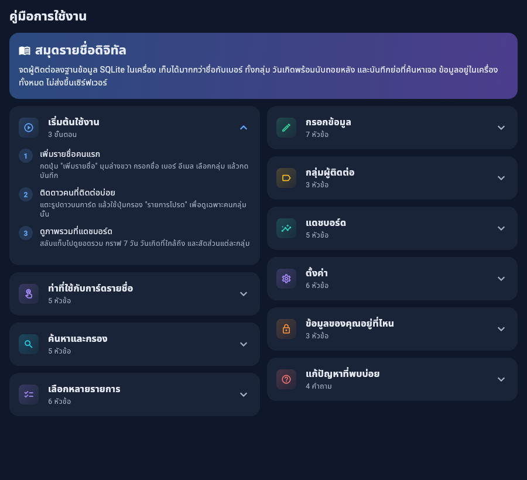
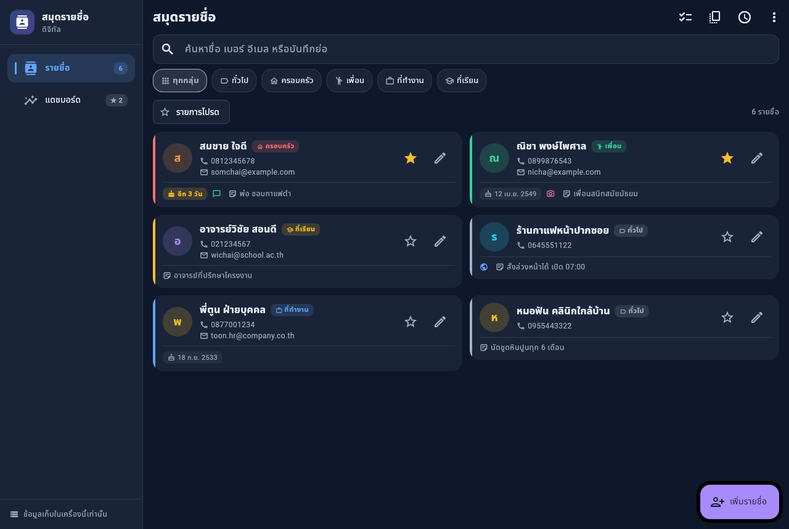
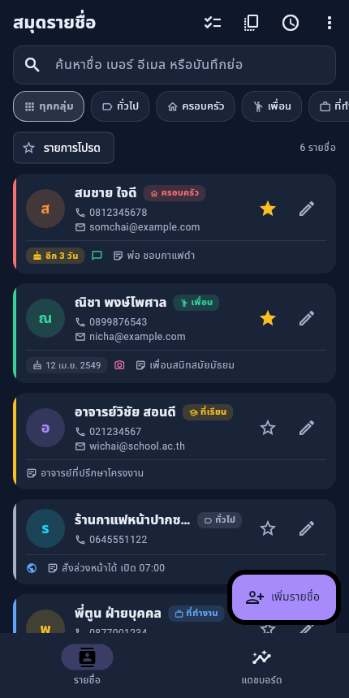
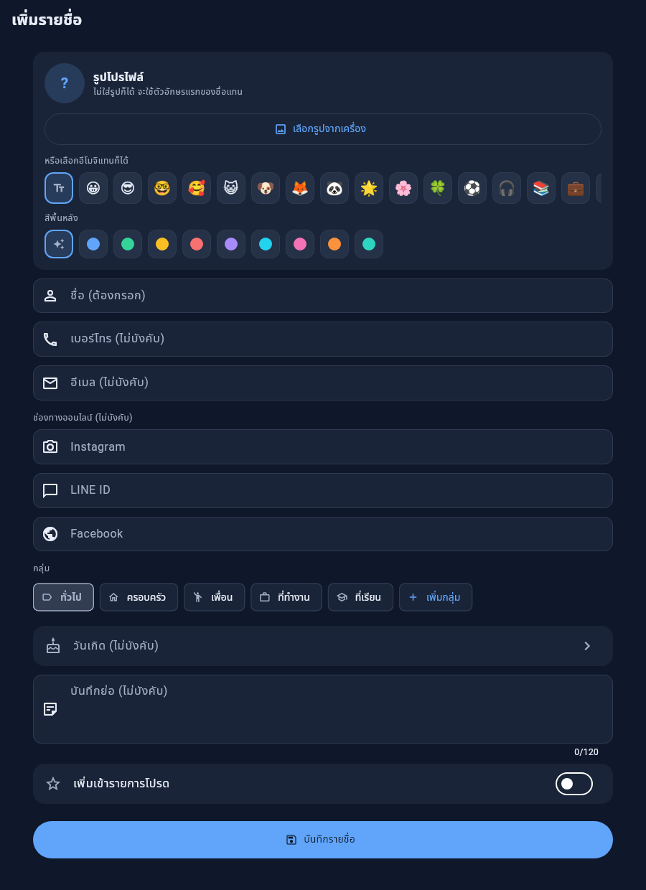
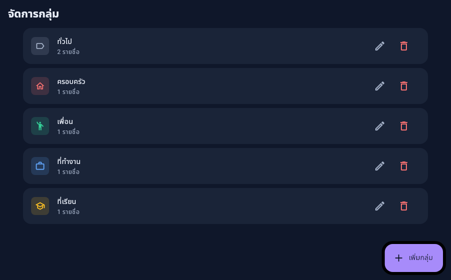
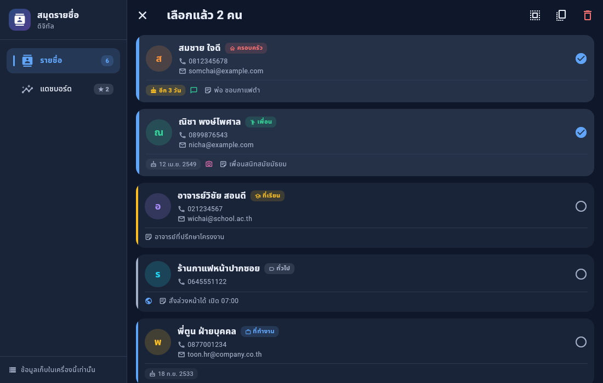
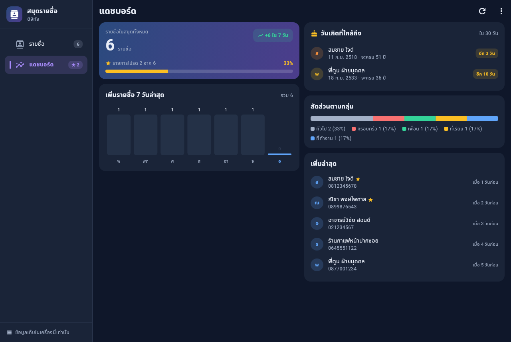
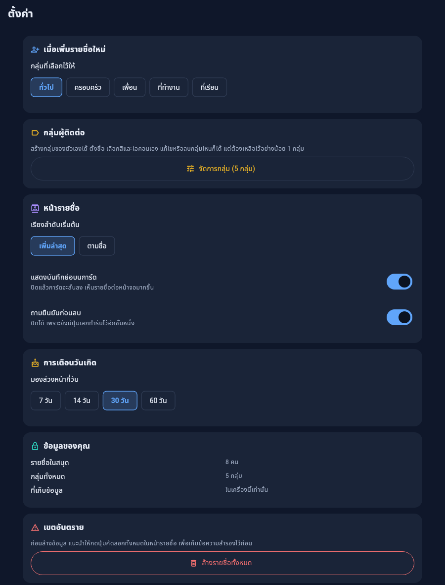

# คู่มือการใช้งาน — สมุดรายชื่อดิจิทัล

คู่มือสำหรับผู้ใช้ทั่วไป อธิบายทีละขั้นว่าแต่ละหน้าจอทำอะไรได้บ้าง
ไม่ต้องมีความรู้ด้านโปรแกรมก็อ่านได้

> ในแอปมีคู่มือย่อให้เปิดอ่านได้ทันทีเช่นกัน กดเมนูสามจุดมุมขวาบน แล้วเลือก **คู่มือการใช้งาน**

*คู่มือในแอป แต่ละหัวข้อเป็นแถบที่กดพับเก็บได้ จะได้เห็นหัวข้อทั้งหมดในหน้าเดียวก่อนแล้วค่อยกางอันที่อยากอ่าน*

---

## 1. ภาพรวมหน้าจอ

แอปมี 2 หน้าหลัก สลับได้จากแถบเมนู

| หน้า | ใช้ทำอะไร |
| --- | --- |
| **รายชื่อ** | ดู เพิ่ม แก้ไข ลบ ค้นหา และกรองรายชื่อ |
| **แดชบอร์ด** | ดูภาพรวมทั้งหมด กราฟ และวันเกิดที่ใกล้ถึง |

อีกสองหน้าอยู่ในเมนูสามจุดมุมขวาบน เพราะเปิดใช้นาน ๆ ครั้ง

| หน้า | ใช้ทำอะไร |
| --- | --- |
| **คู่มือการใช้งาน** | วิธีใช้ทุกฟีเจอร์ และวิธีแก้ปัญหา |
| **ตั้งค่า** | ค่าเริ่มต้น การแสดงผล และข้อมูลระบบ |

*หน้ารายชื่อบนจอคอมพิวเตอร์ ซ้ายมือคือแถบเมนู ตัวเลขท้ายเมนูบอกจำนวนรายชื่อและจำนวนรายการโปรด
ถัดมาเป็นช่องค้นหา แถบเลือกกลุ่ม แล้วจึงเป็นการ์ดรายชื่อเรียงสองคอลัมน์*

**บนจอกว้าง** เช่นคอมพิวเตอร์หรือแท็บเล็ตแนวนอน แถบเมนูจะย้ายไปอยู่ด้านซ้าย
พร้อมป้ายบอกจำนวนรายชื่อ และเนื้อหาจะจัดเป็นสองคอลัมน์เพื่อไม่ให้ต้องเลื่อนยาว

*หน้าเดียวกันบนมือถือ แถบเมนูย้ายลงไปอยู่ด้านล่างให้กดถึงด้วยนิ้วโป้ง
และการ์ดเรียงเป็นคอลัมน์เดียว เนื้อหาทั้งหมดยังเท่าเดิม ไม่ได้ตัดอะไรทิ้ง*

---

## 2. เพิ่มรายชื่อใหม่

1. อยู่ที่หน้า **รายชื่อ**
2. กดปุ่ม **เพิ่มรายชื่อ** ที่มุมล่างขวา
3. กรอกข้อมูล แล้วกด **บันทึกรายชื่อ**

*ฟอร์มทั้งหน้า เรียงจากบนลงล่าง: รูปโปรไฟล์ → ชื่อ เบอร์ อีเมล → ช่องทางออนไลน์ →
กลุ่ม → วันเกิด → บันทึกย่อ → สวิตช์รายการโปรด → ปุ่มบันทึก
ช่องที่ไม่บังคับจะเขียนกำกับไว้ในช่องเลยว่า "(ไม่บังคับ)" จะได้ไม่ต้องเดา*

### ช่องเดียวที่ต้องกรอกคือชื่อ

**ชื่อ** ต้องยาวอย่างน้อย 2 ตัวอักษร

**ช่องทางติดต่อ** ไม่บังคับทีละช่อง แต่ต้องกรอกอย่างน้อยหนึ่งช่อง
จะเป็นเบอร์โทร อีเมล หรือช่องทางออนไลน์ก็ได้ เพราะรายชื่อที่ติดต่อกลับไม่ได้เลย
ก็ไม่มีประโยชน์ที่จะเก็บไว้

ถ้ากรอกผิดรูปแบบ จะมีข้อความสีแดงขึ้นใต้ช่องนั้น เช่น เบอร์โทรที่มีตัวเลขไม่ถึง 9 หลัก
หรืออีเมลที่ไม่มีเครื่องหมาย `@`

### ช่องอื่นที่ใส่เพิ่มได้

| ช่อง | รายละเอียด |
| --- | --- |
| รูปโปรไฟล์ | กด **เลือกรูปจากเครื่อง** ที่หัวฟอร์ม หรือเลือกอีโมจิแทนก็ได้ |
| กลุ่ม | เลือกจากปุ่ม กดปุ่ม **เพิ่มกลุ่ม** เพื่อสร้างกลุ่มใหม่ได้เลยจากในฟอร์ม |
| Instagram / LINE ID / Facebook | กรอกช่องไหนก็ได้ |
| วันเกิด | เลือกจากปฏิทิน ครั้งแรกจะให้เลือก**ปี**ก่อน แล้วค่อยเลือกวัน กดกากบาทเพื่อล้างค่า |
| บันทึกย่อ | เช่น "รู้จักจากงานสัมมนา" ใช้ค้นหาได้ด้วย |
| รายการโปรด | สวิตช์ท้ายฟอร์ม ติดดาวได้ตั้งแต่ตอนสร้าง |

---

## 3. รูปโปรไฟล์

แอปเลือกรูปให้แสดงตามลำดับนี้

1. **รูปจริงที่เลือกจากเครื่อง** — กดปุ่มเลือกรูปที่หัวฟอร์ม
   กดปุ่มถังขยะข้าง ๆ เพื่อเอารูปออก
2. **อีโมจิ** — ถ้ายังไม่ได้ใส่รูป จะมีแถวอีโมจิกับสีพื้นหลังให้เลือก
3. **ตัวอักษรแรกของชื่อ** — ถ้าไม่เลือกอะไรเลย แอปจะใช้แบบนี้ให้
   โดยเลือกสีจากชื่อ คนคนเดิมจะได้สีเดิมทุกครั้ง

---

## 4. กลุ่มผู้ติดต่อ

มีให้ 5 กลุ่มตั้งแต่แรก — ทั่วไป ครอบครัว เพื่อน ที่ทำงาน ที่เรียน

**สร้างกลุ่มของตัวเองได้** ตั้งชื่อ เลือกสีและไอคอนเอง ทำได้ 2 ทาง

- กดปุ่ม **เพิ่มกลุ่ม** ในฟอร์มกรอกรายชื่อ จะได้ไม่ต้องออกจากฟอร์ม
- ไปที่ **ตั้งค่า → จัดการกลุ่ม** สำหรับจัดการหลายกลุ่มพร้อมกัน

*หน้าจัดการกลุ่ม แต่ละแถวบอกสี ไอคอน และจำนวนคนในกลุ่มนั้น
รูปดินสอคือแก้ไข รูปถังขยะคือลบ กดปุ่มม่วงมุมล่างขวาเพื่อสร้างกลุ่มใหม่*

**แก้ไขและลบ** ทุกกลุ่มแก้ชื่อ สี ไอคอน และลบได้หมด รวมถึง 5 กลุ่มที่มีมาให้ตั้งแต่แรกด้วย
มีข้อแม้เดียวคือต้องเหลือไว้อย่างน้อย 1 กลุ่ม เพราะทุกคนในสมุดต้องมีกลุ่มสังกัด
ถ้าลบกลุ่มที่มีคนอยู่ คนเหล่านั้นจะย้ายไปกลุ่มที่เหลืออยู่ **ไม่ได้ถูกลบทิ้งไปด้วย**
และกล่องยืนยันจะบอกชื่อกลุ่มปลายทางให้เห็นก่อนกดลบเสมอ

สีของกลุ่มจะปรากฏเป็นขีดสีด้านซ้ายของการ์ด และเป็นสีในกราฟสัดส่วนบนแดชบอร์ด

---

## 5. ค้นหาและกรอง

| เครื่องมือ | วิธีใช้ |
| --- | --- |
| **ช่องค้นหา** | พิมพ์แล้วผลลัพธ์เปลี่ยนทันทีทุกตัวอักษร ค้นทั้งชื่อ เบอร์ อีเมล และบันทึกย่อ |
| **แถบกลุ่ม** | เลื่อนแนวนอนเลือกกลุ่ม กดกลุ่มเดิมซ้ำเพื่อยกเลิกการกรอง |
| **ปุ่มรายการโปรด** | แสดงเฉพาะคนที่ติดดาวไว้ |
| **ปุ่มเรียงลำดับ** | สลับระหว่างเพิ่มล่าสุด กับเรียงตามชื่อ |

ใช้ทั้งสี่อย่างพร้อมกันได้ ตัวเลขมุมขวาบอกว่าเหลือกี่รายชื่อหลังกรองแล้ว

> **จำชื่อไม่ได้ก็หาเจอ** ช่องค้นหาค้นในบันทึกย่อด้วย ถ้าเคยเขียนไว้ว่า
> "เจอที่งานสัมมนา" ก็พิมพ์คำว่า "สัมมนา" หาได้เลย

---

## 6. จัดการรายชื่อ

| ท่า | ผลลัพธ์ |
| --- | --- |
| **แตะการ์ด** | เปิดหน้ารายละเอียดเพื่อดูและแก้ไข |
| **แตะรูปดินสอ** | เปิดหน้าเดียวกับการแตะการ์ด |
| **แตะรูปดาว** | สลับเข้า-ออกรายการโปรด |
| **กดการ์ดค้าง** | เปิดเมนูคัดลอก และทางเข้าโหมดเลือกหลายรายการ |

**ปุ่มลบอยู่ในหน้ารายละเอียด** มุมขวาบน ไม่ได้อยู่บนการ์ดในรายการ
เพื่อไม่ให้เผลอกดโดนตอนเลื่อนดูรายชื่อ

**ลบผิดคนไม่ต้องตกใจ** หลังลบจะมีแถบข้อความขึ้นด้านล่างพร้อมปุ่ม **เลิกทำ**
กดแล้วรายชื่อกลับมาเหมือนเดิมทุกอย่าง แต่ต้องกดก่อนแถบหายไป

### เลือกหลายคนพร้อมกัน

เข้าโหมดได้ 2 ทาง — กดปุ่มติ๊กถูกบนแถบด้านบน หรือกดการ์ดค้างแล้วเลือก **เลือกหลายรายการ**

ในโหมดนี้ แตะการ์ดคือการติ๊กเลือก แตะซ้ำเพื่อเอาออก แล้วใช้ปุ่มบนแถบด้านบนได้:
**เลือกทั้งหมด** · **คัดลอกที่เลือก** · **ลบที่เลือก** (ถามยืนยันเสมอ และมีปุ่มเลิกทำ)

*โหมดเลือกหลายรายการ การ์ดที่เลือกไว้จะมีเครื่องหมายถูกและพื้นการ์ดสว่างขึ้นทั้งใบ
หัวข้อด้านบนนับให้ว่าเลือกไปกี่คน ปุ่มขวาบนเรียงจากซ้าย: เลือกทั้งหมด · คัดลอก · ลบ*

กดกากบาทมุมซ้ายบนเพื่อออกจากโหมด หรือเอาออกจนไม่เหลือใครที่เลือกไว้

> ใช้ร่วมกับการกรองได้ เช่น กรองกลุ่ม "ที่ทำงาน" ก่อน แล้วกดเลือกทั้งหมด
> เพื่อคัดลอกเฉพาะคนในกลุ่มนั้น

**คัดลอกทั้งสมุด** ปุ่มบนแถบด้านบนคัดลอกทุกรายชื่อ*ตามที่กรองอยู่ตอนนั้น*
เป็นข้อความก้อนเดียว ใช้ส่งต่อให้คนอื่นหรือเก็บสำรองไว้ก่อนล้างข้อมูล

---

## 7. แดชบอร์ด

*หน้าแดชบอร์ด อ่านซ้ายไปขวา บนลงล่าง: แถบสรุปยอดรวม กราฟ 7 วันล่าสุด
วันเกิดที่ใกล้ถึง สัดส่วนตามกลุ่ม และรายชื่อที่เพิ่มล่าสุด*

การ์ด 5 ใบ แต่ละใบตอบคนละคำถาม

| การ์ด | บอกอะไร |
| --- | --- |
| **แถบสรุป** | ยอดรวมทั้งสมุด สัดส่วนรายการโปรด และยอดที่เพิ่มในรอบ 7 วัน |
| **กราฟ 7 วันล่าสุด** | แท่งละหนึ่งวัน แท่งขวาสุดคือวันนี้ ทำสีเข้มไว้ |
| **วันเกิดที่ใกล้ถึง** | คนที่วันเกิดอยู่ในช่วงที่ตั้งไว้ พร้อมบอกว่าจะครบกี่ปี |
| **สัดส่วนตามกลุ่ม** | แถบสีเดียวต่อกัน พร้อมจำนวนและเปอร์เซ็นต์ |
| **เพิ่มล่าสุด** | ห้าคนหลังสุด พร้อมเวลาแบบ "เมื่อ 3 ชั่วโมงก่อน" |

ตัวเลขอัปเดตเองทุกครั้งที่เพิ่ม แก้ไข หรือลบรายชื่อ
ถ้าอยากสั่งโหลดใหม่เอง ให้ดึงหน้าลง หรือกดปุ่มรีเฟรชมุมขวาบน

---

## 8. ตั้งค่า

เปิดจากเมนูสามจุดมุมขวาบน **ทุกค่ามีผลทันทีที่กด ไม่มีปุ่มบันทึกให้ต้องจำ**
และค่าที่ตั้งไว้จะอยู่ถาวรแม้ปิดแอป

*หน้าตั้งค่า แบ่งเป็นกล่องตามเรื่อง แต่ละค่ามีคำอธิบายใต้ชื่อว่าเปลี่ยนแล้วเกิดอะไรขึ้น*

| หมวด | ปรับอะไรได้ |
| --- | --- |
| เมื่อเพิ่มรายชื่อใหม่ | เลือกกลุ่มที่จะติ๊กไว้ให้ล่วงหน้า |
| กลุ่มผู้ติดต่อ | เข้าหน้าจัดการกลุ่ม เพิ่ม แก้ไข ลบ |
| หน้ารายชื่อ | เรียงลำดับเริ่มต้น · แสดงบันทึกย่อบนการ์ด · ถามยืนยันก่อนลบ |
| การเตือนวันเกิด | มองล่วงหน้า 7, 14, 30 หรือ 60 วัน |
| ข้อมูลของคุณ | จำนวนรายชื่อและจำนวนกลุ่มที่มีอยู่ |
| เขตอันตราย | ล้างรายชื่อทั้งหมด |

> **ก่อนล้างข้อมูล** แนะนำให้กดปุ่มคัดลอกทั้งหมดในหน้ารายชื่อเก็บไว้ก่อน
> เพราะการล้างข้อมูล **กดเลิกทำไม่ได้**

---

## 9. ข้อมูลของคุณอยู่ที่ไหน

ทุกอย่างอยู่ในเครื่องคุณเท่านั้น **ไม่มีการส่งขึ้นอินเทอร์เน็ต** และใช้งานได้โดยไม่ต้องต่อเน็ต

- **บนมือถือ** ข้อมูลจะอยู่จนกว่าจะถอนแอปออก
- **บนเบราว์เซอร์** ข้อมูลผูกกับที่อยู่เว็บที่ใช้เปิด
  ถ้าเปลี่ยนที่อยู่หรือเปลี่ยนเบราว์เซอร์ จะเห็นเป็นสมุดเปล่า ข้อมูลไม่ได้หาย แค่คนละที่เก็บกัน

**อยากเก็บสำรอง** กดปุ่มคัดลอกทั้งหมดในหน้ารายชื่อ แล้ววางเก็บไว้ในโน้ตหรือส่งเข้าแชตตัวเอง

---

## 10. แก้ปัญหาที่พบบ่อย

**เพิ่มรายชื่อแล้วไม่ขึ้นในรายการ**
ตรวจว่ามีการกรองค้างอยู่หรือไม่ ทั้งช่องค้นหา แถบกลุ่ม และปุ่มรายการโปรด
ล้างทั้งสามอย่างแล้วรายชื่อจะกลับมาครบ

**รายชื่อที่เคยกรอกหายไปหมด**
ถ้าใช้บนเบราว์เซอร์ ให้ตรวจว่าเปิดจากที่อยู่เดิมหรือไม่ (ดูข้อ 9)

**บันทึกไม่ได้ ปุ่มกดแล้วไม่มีอะไรเกิดขึ้น**
เลื่อนดูช่องกรอกด้านบน จะมีข้อความสีแดงบอกว่าช่องไหนยังไม่ผ่าน
หรือถ้ายังไม่ได้กรอกช่องทางติดต่อเลยสักช่อง จะมีข้อความขึ้นด้านล่างจอ

**กลุ่มที่เคยสร้างหายไป**
ถ้าลบกลุ่มไป คนที่เคยอยู่กลุ่มนั้นจะย้ายไปกลุ่ม "ทั่วไป" ไม่ได้หายไปไหน
ดูได้จากหน้ารายชื่อโดยเลือกกรองที่กลุ่มทั่วไป

**แดชบอร์ดยังเป็นตัวเลขเดิม**
ดึงหน้าลงเพื่อรีเฟรช หรือกดปุ่มรีเฟรชมุมขวาบน
